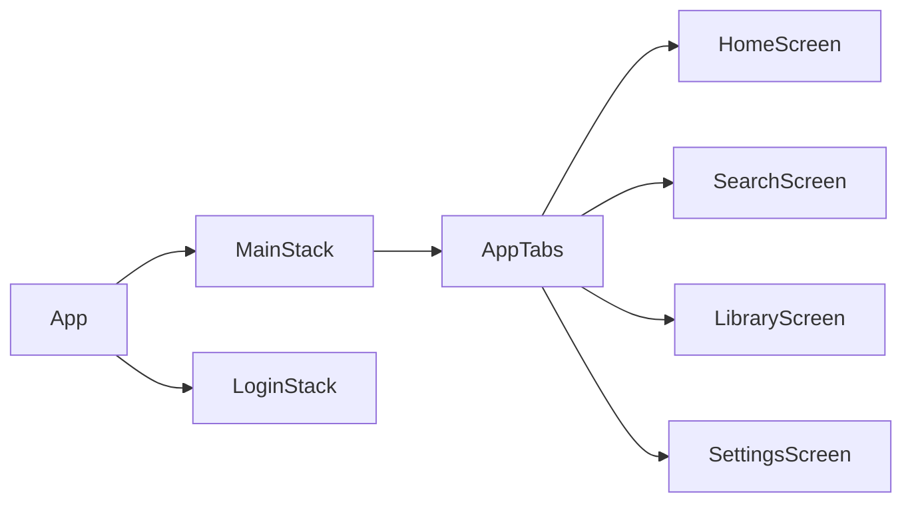

# Introdução

## Visão Geral do Porjeto

**Lorem Ipsum** is simply dummy text of the printing and typesetting industry. Lorem Ipsum has been the industry's standard dummy text ever since the 1500s, when an unknown printer took a galley of type and scrambled it to make a type specimen book. It has survived not only five centuries, but also the leap into electronic typesetting, remaining essentially unchanged. It was popularised in the 1960s with the release of Letraset sheets containing Lorem Ipsum passages, and more recently with desktop publishing software like Aldus PageMaker including versions of Lorem Ipsum.

## Objetivo do Documento

**Lorem Ipsum** is simply dummy text of the printing and typesetting industry. Lorem Ipsum has been the industry's standard dummy text ever since the 1500s, when an unknown printer took a galley of type and scrambled it to make a type specimen book. It has survived not only five centuries, but also the leap into electronic typesetting, remaining essentially unchanged. It was popularised in the 1960s with the release of Letraset sheets containing Lorem Ipsum passages, and more recently with desktop publishing software like Aldus PageMaker including versions of Lorem Ipsum.

# Estrutura do Projeto

## Estrutura de Pastas e descrição de Arquivos

```bash
*my-project/
├── assets/         # Pasta para armazenar recursos estáticos do projeto.
│   ├── icons/      # Subpasta para ícones utilizados na aplicação.
├── src/            # Pasta principal para o código-fonte do projeto.
│   ├── components/ # Componentes reutilizáveis.
│   ├── config/     # Configurações do projeto, como variáveis de ambiente e arquivos de configuração.
│   ├── context/    # Contextos do React para gerenciar estado global.
│   ├── lib/        # Biblioteca de funções e utilitários gerais.
│   ├── navigation/ # Arquivos relacionados à configuração e gerenciamento da navegação dentro do aplicativo.
│   ├── screens/    # Telas do aplicativo, que representam as diferentes páginas ou views.
│   ├── services/   # Serviços para interagir com APIs externas, autenticação e outras funcionalidades backend.
│   └── theme/      # Arquivos relacionados ao tema e estilos do aplicativo.
├── App.js          # Arquivo principal que configura e inicializa o aplicativo.
├── app.json        # Arquivo de configuração do Expo que define as configurações do projeto.
├── package.json    # Arquivo que lista as dependências do projeto e scripts para execução de comandos.*
```

## Estrutura de Navegação


